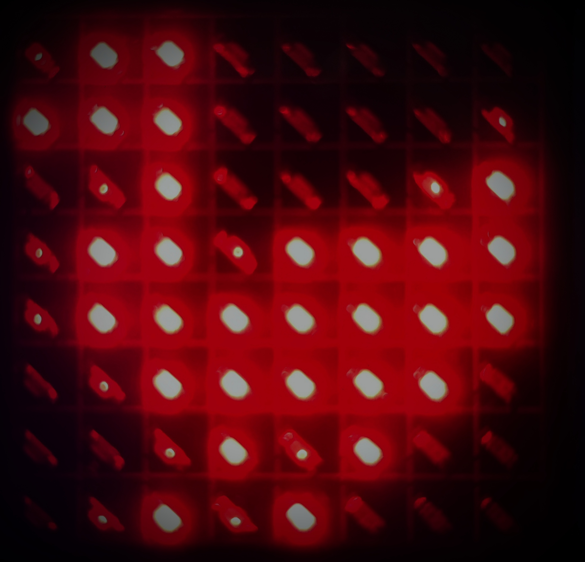
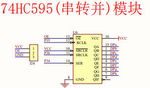

* ***Pic:***

The default picture:

This form show the pic of  8*8 Matrix LED. **1 is bright.**

|   | 1 | 1 |   |   |   |   |   |
| - | - | - | :- | - | - | - | - |
| 1 | 1 | 1 |   |   |   |   |   |
|   |   | 1 |   |   |   |   | 1 |
|   | 1 | 1 |   | 1 | 1 | 1 | 1 |
|   | 1 | 1 | 1 | 1 | 1 | 1 | 1 |
|   |   | 1 | 1 | 1 | 1 | 1 |   |
|   |   |   | 1 |   | 1 |   |   |
|   |   | 1 |   | 1 |   |   |   |

---

* ***Devel:***

This devel part is aim to helping those machine that don't have lights on the 74HC595, which to show the binary data.

Therefore, I redirect the LED module of the single-chip microcomputer to be 74HC595 dev-tool.

Also, you can improve it to meet your needs.

Tip:

**This LED only play its role well when you show just one dot on the Matrix_Led.**

---

* ***Reference:***

Teaching:[Bilibili](https://www.bilibili.com/video/BV1Mb411e7re/?spm_id_from=333.999.0.0&vd_source=305bda79fa63482fe6c631e72914b10b)
[BaiduNetdisk](https://pan.baidu.com/s/1vDTN2o8ffvczzNQGfyjHng#list/path=%2F&parentPath=%2F)
*(You can use these tools to auto-format you graphic coding)*

